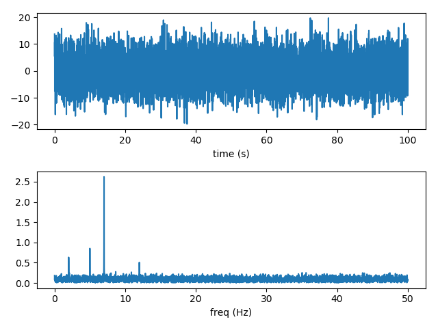
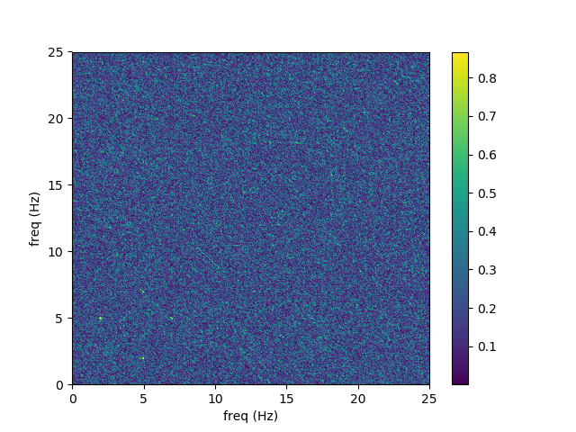
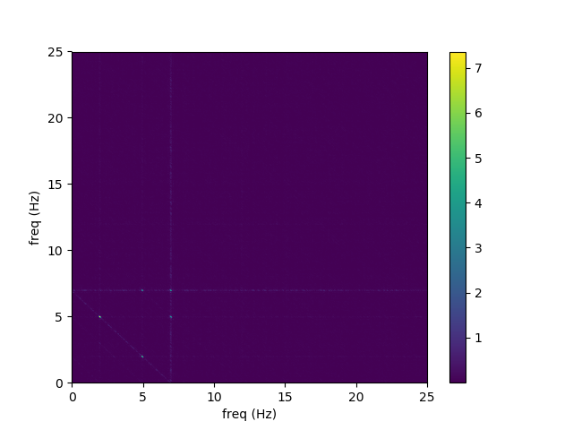

## Calculate bicoherence, bispectrum, polycoherence and polyspectrum

#### Import functions and create a signal, plot signal and spectrum

```py
from math import pi
import numpy as np
import matplotlib.pyplot as plt
from scipy.fftpack import next_fast_len

from polycoherence import _plot_signal, polycoherence, plot_polycoherence

N = 10001
t = np.linspace(0, 100, N)
fs = 1 / (t[1] - t[0])
s1 = np.cos(2 * pi * 5 * t + 0.2)
s2 = 3 * np.cos(2 * pi * 7 * t + 0.5)
np.random.seed(0)
noise = 5 * np.random.normal(0, 1, N)
signal = s1 + s2 + 0.5 * s1 * s2 + noise
_plot_signal(t, signal)
```




#### Calculate and plot bicoherence

```py
kw = dict(nperseg=N // 10, noverlap=N // 20, nfft=next_fast_len(N // 2))
freq1, freq2, bicoh = polycoherence(signal, fs, **kw)
plot_polycoherence(freq1, freq2, bicoh)
```



#### Calculate and plot bispectrum

```py
freq1, fre2, bispec = polycoherence(signal, fs, norm=None, **kw)
plot_polycoherence(freq1, fre2, bispec)
```



#### Calculate and plot part of the bicoherence

```py
freq1, freq2, bicoh = polycoherence(signal, fs, flim1=(0, 10), flim2=(0, 10), **kw)
plot_polycoherence(freq1, freq2, bicoh)
```


